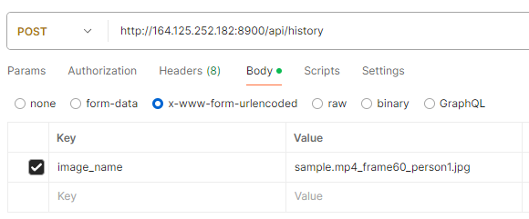

# FindSuspect

## 업로드

### 영상 업로드

post /api/upload/video

videoFile에 이미지 넣고 요청

저장경로 src/main/frontend/uploads/video

### 사진 업로드 

post /api/upload/image

imageFile에 이미지 넣고 요청

저장경로 src/main/frontend/server/uploads/image

기존 업로드에서 영상 하나만 넣고 전송하면됨 

### 영상 삭제

delete /api/video

video_name으로 지우고 싶은 영상이름 넣어서 요청

## 경로

### 이미지 경로

request get /api/get/image

response image/sample.jpg/sample.jpg

### 영상 경로

request get /api/get/video 

response 
```
[
    "sample2.mp4",
    "2021-08-02_06-21-00_mon_sunny_out_ja-ma_C0041.mp4",
    "KakaoTalk_Video_2024-09-05-15-01-49.mp4",
    "sample.mp4"
]
```

## 결과

get /api/result //모든 영상을 정확도 순 정렬

get /api/result/videoName //영상이름 오름차순 정렬 후 정확도 내림차순한 결과

```
[
    {
        "sample.mp4_frame60_person1.jpg": {
            "video_name": "sample.mp4",
            "similarity": 98.92123387745694,
            "original_top5": [
                0.9172,
                0.5366,
                0.0535,
                0.653,
                0.4283
            ],
            "file_top5": [
                0.9234,
                0.8794,
                0.0627,
                0.8977,
                0.3649
            ],
            "attr_words": [
                "top short",
                "bottom short",
                "shoulder bag",
                "backpack",
                "hat"
            ],
            "time": "0:02",
            "videoName": "sample.mp4",
            "originalTop5": [
                0.9172,
                0.5366,
                0.0535,
                0.653,
                0.4283
            ],
            "fileTop5": [
                0.9234,
                0.8794,
                0.0627,
                0.8977,
                0.3649
            ],
            "attrWords": [
                "top short",
                "bottom short",
                "shoulder bag",
                "backpack",
                "hat"
            ]
        }
    },
    ... 이하 생략
}
```

형식으로 나감

## 히스토리

### 히스토리 저장
request post /api/history

image_name 에 저장하고싶은 video캡처 사진 이름을 넣어서요청



### 히스토리 요청
request 

get /api/history?page=0 //최신순 첫페이지 page=0이 기본값 생략 가능

get /api/history?sort=videoName //영상이름 내림차순

response
```
{
    "histories": [
        {
            "imageName": "image/sample4.mp4_frame5_person1_cropped.jpg/sample4.mp4_frame5_person1_cropped.jpg",
            "imageCropped": "image/sample4.mp4_frame5_person1_cropped.jpg/sample4.mp4_frame5_person1_cropped.jpg_cropped.jpg",
            "imageRectangle": "image/sample4.mp4_frame5_person1_cropped.jpg/sample4.mp4_frame5_person1_cropped.jpg_rectangle.jpg",
            "video_image": "sample2.mp4_frame20_person1.jpg",
            "video_name": "sample2.mp4",
            "similarity": 77.17966173943887,
            "original_top5": [
                0.7131,
                0.9541,
                0.0158,
                0.9598,
                0.4052
            ],
            "file_top5": [
                0.7089,
                0.8367,
                0.744,
                0.9329,
                0.6406
            ],
            "attr_words": [
                "짧은 상의",
                "짧은 하의",
                "숄더백",
                "백팩",
                "모자"
            ],
            "time": "0:20"
    },
    ...
        
    ],
    "totalElements": 6, //총 개수
    "totalPages": 2 //페이지 개수 (기본 5)
}
```


