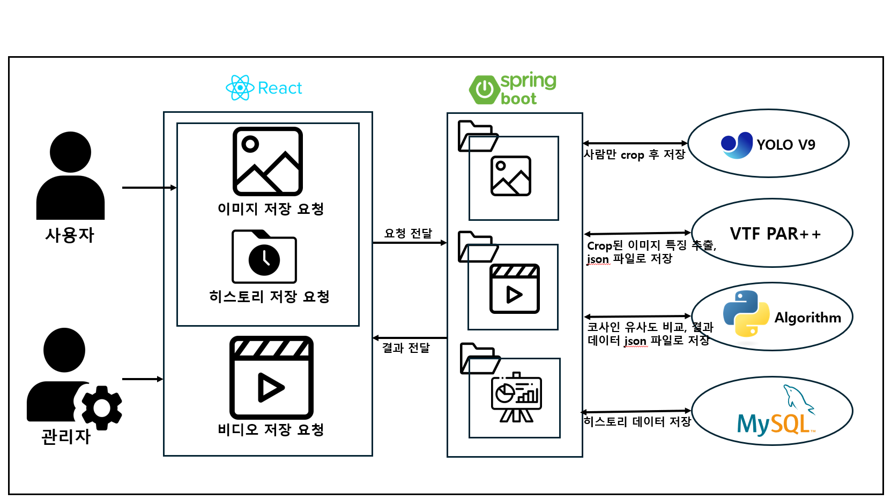
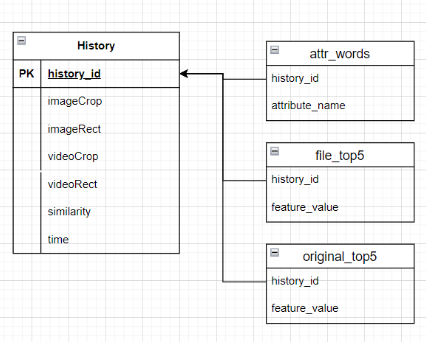
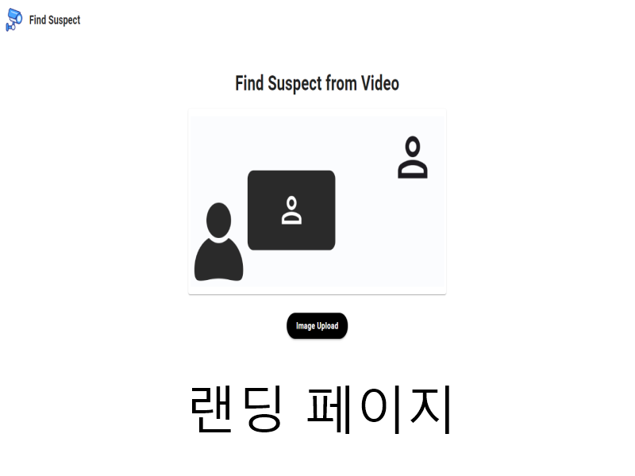
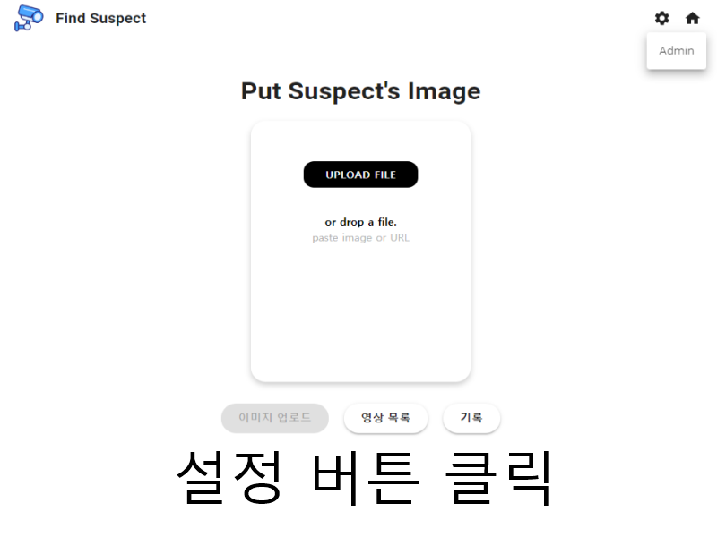
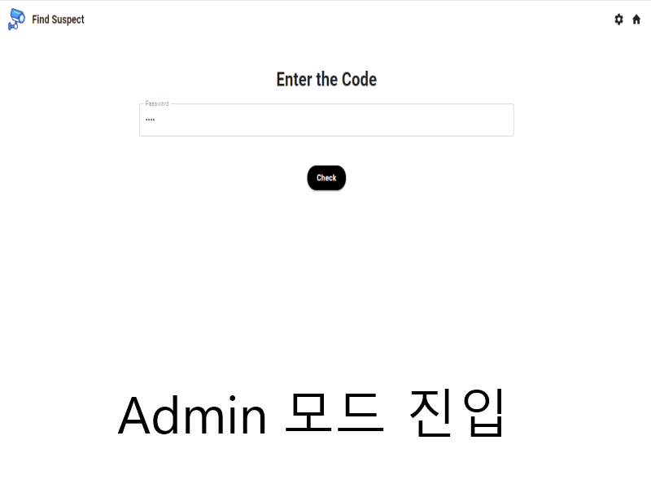
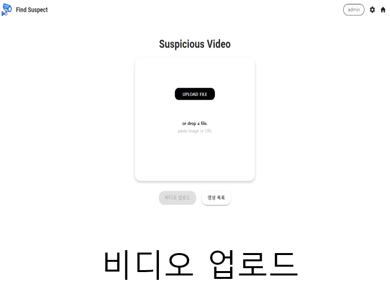
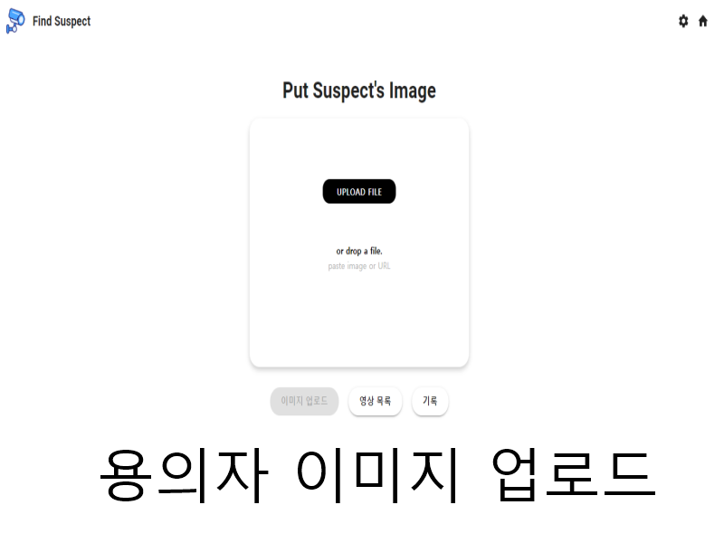
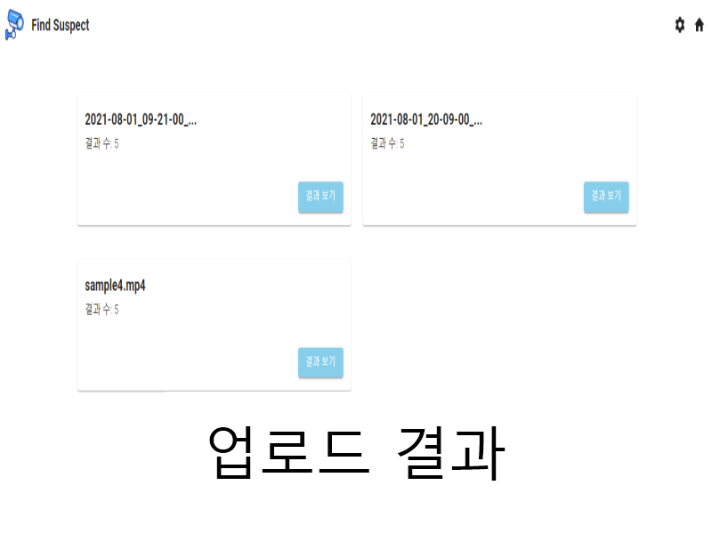
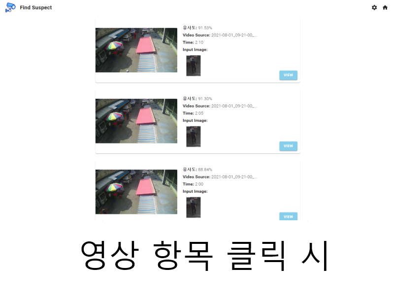
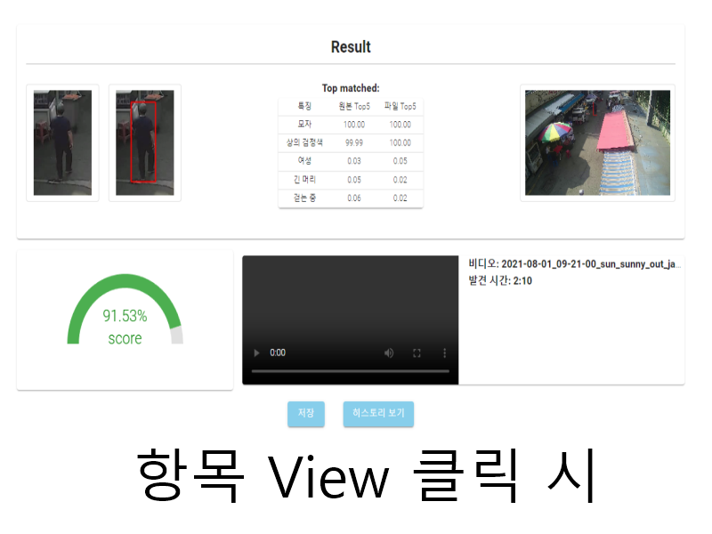

# FindSuspect
 

- 2024 전기 졸업과제 A2O 팀

- 이미지기반 객체(용의자) 검색 시스템 개발

- https://findsuspect.modelx.me/

## 프로젝트 멤버 및 담당파트
|멤버|소속 및 학번| 주 개발 분야|세부 역할|
|-|---|-|-----------|
| 
    [canyos](https://github.com/canyos) (이풍헌) 
 | 정보컴퓨터공학   201924548   4581974@naver.com &nbsp;&nbsp;&nbsp;&nbsp;&nbsp; | 백엔드 &nbsp;&nbsp;&nbsp;&nbsp;&nbsp;&nbsp;&nbsp;&nbsp;&nbsp;&nbsp;&nbsp;&nbsp;&nbsp; | - YOLO모델을 활용해 이미지와 영상에서 사람부분을 추출   - Spring framework를 사용해 웹 인터페이스 백엔드 개발   - Spring에서 들어온 요청을 처리한 후 결과를 저장하는 파이프라인 구축   - Spring Jpa를 활용해 history 데이터베이스 구축 |
| 
    [ssigner](https://github.com/ssigner) (김종훈) 
 | 정보컴퓨터공학   201924442   huni00807@gmail.com  | 알고리즘  | - YOLOv9 모델 학습   - VTFPAR++ 모델을 사용해 보행자의 특징을 구한다음 유사도 측정 알고리즘 개발   - QA 및 프론트 예외 처리                                       |
| 
    [Bae-JunSeok](https://github.com/Bae-JunSeok) (배준석) 
 | 정보컴퓨터공학   201724486   qownstjr77@gmail.com | 프론트엔드    | - React를 사용해 UI 개발  - 프론트엔드 백엔드 연결 |

## 프로젝트 소개

- 이 프로젝트는 **여러 CCTV 영상**에서 한 명의 용의자(또는 실종된 사람)**이미지를 기반**으로 찾아 **유사도와 유사한 특징을 함께 제공**하는 것을 목표로 합니다.

- CCTV 영상에서 **YOLOv9 모델**을 이용해 영상 속 사람들을 모두 찾아 저장하고 **VTFPAR++ 모델**을 이용해 사람들의 특징을 JSON으로 저장합니다.

- 용의자 이미지에서 **YOLOv9 모델**을 이용해 이미지 속 사람을 찾아 저장하고 **VTFPAR++ 모델**을 이용해 용의자의 특징을 구한 다음 위에서 찾은 영상 속 사람들의 특징과 **코사인 유사도** 계산 방식을 통해 유사도를 구해 사용자에게 알려줍니다.

## 프로젝트 필요성

- 저희 프로젝트의 목표는 현재 개별 기술적으로는 가능하지만 **통합된 기술이 없어** 어려움이 있는 기술입니다. 사람을 찾고 이 사람의 특징점을 기준으로 분류하고, 사람의 유사도를 계산하는 각각의 기술은 많은 발전을 이루었고 개별 프로그램이 존재하지만 CCTV 영상을 분석하여 사람을 찾고 분류하고, 유사도를 계산해주는 **통합적인 어플리케이션**은 아직 완성도가 낮아 많이 보급화 되어 있지 않습니다.

- 따라서 완성도가 높은 **통합된 기술**을 개발함으로써 용의자 이미지를 여러 영상에서 빠르고 편리하게 찾을 수 있는 프로그램인 FindSuspect를 개발하였습니다.

## 관련 기술/논문/특허 조사 내용
[YOLOv9](https://arxiv.org/pdf/2402.13616)
- Programmable Gradient Information (PGI): PGI는 심층 네트워크에서 발생하는 정보 손실을 줄이고 목표 과제를 위한 신뢰할 수 있는 경사 정보를 제공하는 새로운 개념입니다. 이를 통해 네트워크의 가중치를 보다 효과적으로 업데이트할 수 있습니다.

- Generalized Efficient Layer Aggregation Network (GELAN): GELAN은 경로 계획을 기반으로 한 새로운 경량 네트워크 아키텍처로, PGI와 결합하여 객체 탐지 성능을 향상시킵니다. GELAN은 일반적인 합성곱 연산만 사용하여 기존의 최신 경량 모델보다 효율적으로 작동합니다.

- 객체 탐지 성능: 제안된 YOLOv9은 MS COCO 데이터셋을 기반으로 한 객체 탐지 실험에서 기존의 최신 모델들과 비교하여 더 우수한 성능을 보여주었습니다. YOLOv9은 경량 모델부터 대형 모델까지 다양한 크기의 네트워크에서 적용 가능하며, 특히 기존에 대규모 데이터셋으로 사전 학습된 모델보다도 더 나은 성능을 보였습니다.

- 기존의 심층 신경망 아키텍처에서 정보 병목 현상과 가역 함수의 문제를 분석하며, 이러한 문제들을 해결하기 위한 PGI와 보조 가역 가지(Auxiliary Reversible Branch)를 설계했습니다. PGI와 GELAN을 결합하여 개발한 YOLOv9은 더 가볍고 빠르면서도 높은 정확도를 유지합니다.

[VTFPAR++](https://arxiv.org/pdf/2404.17929)
- 기존 보행자 속성 인식 모델들은 주로 정적 이미지에 기반하고 있어, 중복된 상황이나 블러 처리된 비디오에서 성능이 떨어지는 문제가 있었습니다. 이를 해결하기 위해 VTFPAR++는 비디오 프레임과 속성 텍스트를 함께 입력으로 사용하고, 이를 멀티모달 비전-언어 융합 문제로 정의합니다.

- 이 프레임워크는 사전 학습된 CLIP 모델을 사용하여 비디오의 시각적 특징을 추출하고, 속성 목록을 텍스트 설명으로 변환하여 텍스트 인코더를 통해 임베딩합니다. 시각적 토큰과 텍스트 토큰을 결합한 후, 이 토큰들을 멀티모달 트랜스포머에 입력하여 상호 작용 학습을 수행합니다. 이 후 속성 예측 헤드를 통해 보행자 속성 예측을 수행합니다.

- VTFPAR++의 핵심적인 차별점은 파라미터 효율적인 튜닝을 위해 스페이셜-템포럴 사이드 튜닝 기법을 제안했다는 점입니다. 이는 큰 파라미터를 가진 모델의 모든 파라미터를 튜닝하는 대신, 사전 학습된 모델의 가벼운 사이드 네트워크만을 최적화하여 높은 성능을 유지하면서도 계산 비용을 줄입니다.

- VTFPAR++는 두 개의 대규모 비디오 기반 보행자 속성 인식 데이터셋에서 기존 모델들을 뛰어넘는 성능을 보여주었으며, 특히 GPU 메모리 사용량, 추론 시간, F1 점수 측면에서 기존 모델들보다 우수함을 입증했습니다.

## 프로젝트 개발 결과물

실제 배포된 프로젝트는 [FindSuspect](https://findsuspect.modelx.me/) 에서 확인 가능 합니다.

### 아키텍처 및 데이터 흐름

- React.js를 사용한 프론트엔드, Spring Framework 기반의 백엔드, YOLO v9 및 VTFPAR++ 알고리즘을 활용한 이미지 처리, 그리고 MySQL 데이터베이스로 구성되어 있습니다.
### ERD

- 저장한 history와 관련된 이미지에 대한 경로, 특성값, 유사도 등을 저장하였습니다. 

## 사용 기술 스택

## Frontend

- React.js v18.3.1
- CSS3

## Backend

- Node.js v14.21.3
- SpringBoot v3.3.1
- Java SDK 21

## Algorithm
 
 
 

- Python v3.10.14
- Pytorch 2.0.1-cuda11.7-cudnn8-runtime
- OpenCV-Python v4.10.0.84

## 개발 결과물을 사용하는 방법
### Admin 기준
1. 첫 화면에서 Image Upload 버튼을 클릭합니다.

2. 톱니바퀴 모양의 설정 버튼을 누르고 Admin 모드에 진입합니다.

3. 미리 설정된 비밀번호를 입력합니다.

4. 확인 하고자 하는 CCTV 영상을 업로드 하거나, 이미 업로드 된 영상을 삭제 가능합니다.

### User 기준
1. 첫 화면에서 Image Upload 버튼을 클릭합니다.

2. 확인 하고자 하는 용의자 이미지를 업로드 합니다.

3. 결과를 확인하고 싶은 영상의 결과 보기를 클릭합니다.

4. 상위 5개의 유사도를 가진 영상의 시간대와 유사도를 확인 가능합니다. VIEW 버튼을 눌러 더욱 자세하게 확인 가능합니다.

## 시연 영상

[추후 추가 예정]
